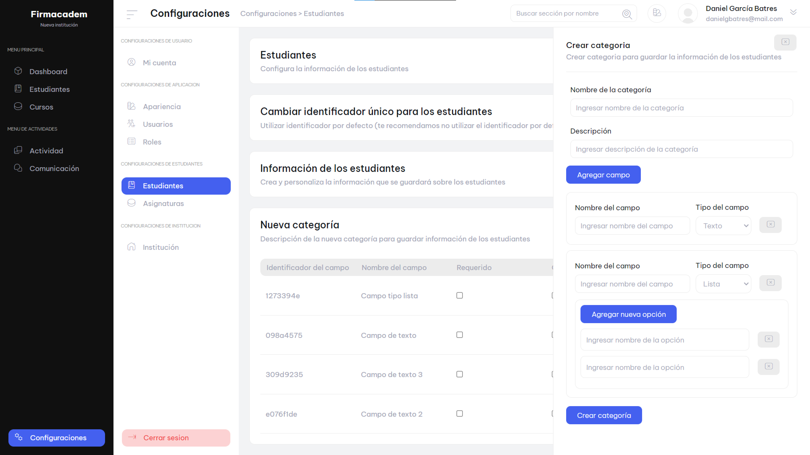

# Application for administration of educational institutions

## Project overview

This project was created using the following technologies:

- 
- 
- 
- 
- 
- 

 The primary goal of the project is to serve as a platform for registering educational institutions. These institutions can manage students, their information, courses, events, activity records, communication, user access control through roles, institution information editing, and subject management.

## Project status

This project is no longer actively maintained. It was developed to showcase skills in working with the mentioned technologies. Please note that there are known issues that need fixing, and the project lacks responsive design.

## Features

- Registration of educational institutions
- Management of students, courses, events, and activity records
- Communication module
- User access control using roles
- Editing institution information
- Subject management

## License

This project is licensed under the [MIT License](LICENSE)

## Project views

### Registration section

### Payment plans

### Themes

### Users

### Dynamic forms

### Role

### Role permissions

### Profile

### Institution

